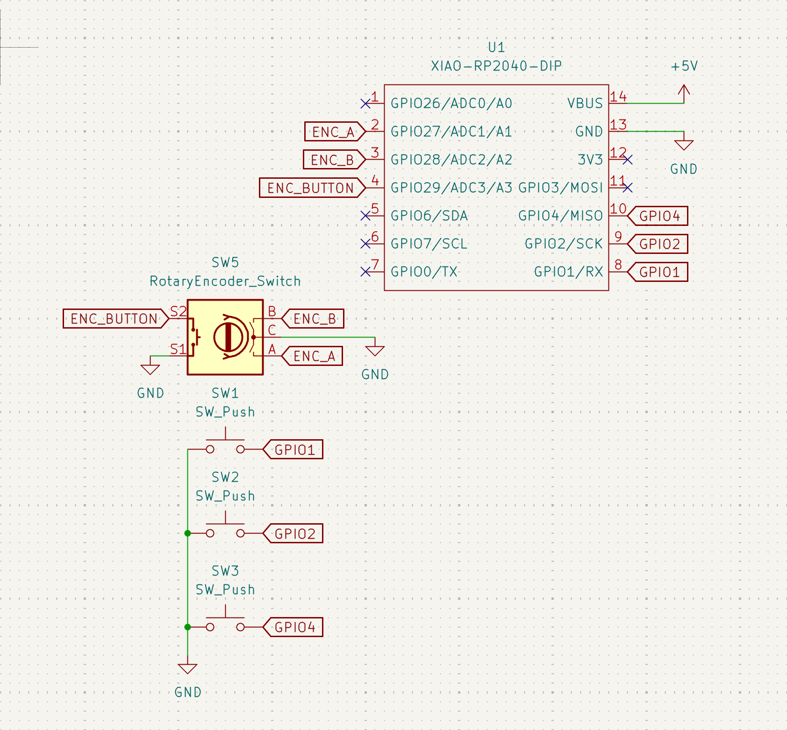

# Nat3z HackPad - TetoBoard

This is the very rudimentary HackPad is created for Highway qualification. It includes a Rotary
Encoder, 3 Cherry MX Switches, and finally, the RP2040!

[Devlog](./Devlog.md)
[Bill of Materials](./BOM.md)

## Images

